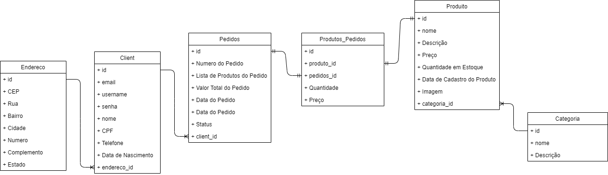

<a name="back-to-top">

[🚧**Issues**](https://github.com/marcosbarker/ecommerce-API-Restful/issues/1)

  

<i>Projeto de conclusão da disciplina feito em grupo como requisito parcial da disciplina Desenvolvimento de API Restful, da Residência de Software do Serratec.</i>

<h3 align="center">Professor Alexandre de Oliveira Paixão</h3>
 

## 🔑API para um Ecommerce atendendo os seguintes Requisitos:
- Utilizar um sistema de login de usuários:  
  * Um Cliente poderá se cadastrar livremente.  
  * Para o cadastro cliente deverá informar os dados mapeados na tabela "Cliente". O Endereço deverá ser validado através da API Via Cep.  
  * Após logado o Cliente poderá fazer as seguintes operações:(Com exceção das duas ultimas todas não poderão ser realizadas sem o envio do token - autenticação na API).  
- Atualizar seus proprios dados pessoais (como Endereço, Telefone, menos CPF):  
  - Deletar sua propria conta.  
  - Criar um novo Pedido.    
  - Editar um pedido com status de não finalizado.  
  - Finalizar um pedido, alterar seu status para finalizado. Ao finalizar o pedido enviar e-mail para o cliente informando data de entrega, produtos, quantidades e valor final do pedido.  
  - Visualizar todas as categorias ou uma especifica pelo nome.  
  - Visualizar todos os produtos ou um específico pelo nome.  

### 📖Sem estar logado ele poderá:
- Visualizar todas as categorias ou uma especifica pelo nome.  
- Criar uma nova categoria.  
- Editar uma categoria.  
- Deletar uma categoria.  
- Visualizar todos os produtos ou um específico pelo nome.  
- Criar um novo produto (Com imagem).  
- Editar um produto.  
- Deletar um produto.  
- Visualizar todos os pedidos.  
- Excluir algum pedido.   

⚠️🔃**Os principais campos deverão ser validados, (cpf, produto não poderá ter valores negativos, etc.) e todas as exceções deverão serem tratadas.**   
🖋**A Api deverá utilizar como documentação a ferramenta do Swagger.**   
⚡**Desafio Extra (Opcional): opção de esqueci minha senha com envio de um código de verificação para o e-mail e posterior verificação se esse código pertence ao cliente.**  
  

   

##  Tecnologia Utilizada
- [**DBeaver**](https://dbeaver.io/)    [(*Documentação*)](https://dbeaver.com/docs/wiki/)
- [**Java**](https://www.oracle.com/java/technologies/)    [(*Documentação*)](https://docs.oracle.com/en/java/)    [(*Documentação MDN*)](https://developer.mozilla.org/en-US/docs/Glossary/Java)
- [**PostgreSQL**](https://www.postgresql.org/)    [(*Documentação*)](http://pgdocptbr.sourceforge.net/pg80/index.html)
- [**Postman**](https://www.postman.com/downloads/)    [(*Documentação*)](https://learning.postman.com/docs/getting-started/introduction/)
- [**Spring Boot**](https://spring.io/)    [(*Documentação*)](https://spring.io/projects/spring-boot)
- [**Spring Tools 4**](https://spring.io/tools)    [(*Documentação*)](https://github.com/spring-projects/sts4/wiki)      
 

## Contribuidores:
<table align="center">
  <tr>
    <td align="center">
      <a href="https://github.com/IgorStumpf">
         
        
          <b>Igor Stumpf</b>
        
      </a>
    </td>
    <td align="center">
      <a href="https://github.com/JpBade">
         
        
          <b>João Paulo Bade</b>
        
      </a> 
    </td>
    <td align="center">
      <a href="https://github.com/mpj144">
         
        
          <b>Marcelo Pires</b>
        
      </a> 
    </td>
    <td align="center">
      <a href="https://github.com/marcosbarker">
         
        
          <b>Marcos Paulo Marques Corrêa</b>
        
      </a> 
    </td>
   </table>
    

&emsp;&emsp;&emsp;&emsp;&emsp;&emsp;&emsp;&emsp;&emsp;&emsp;&emsp;&emsp;&emsp;&emsp;&emsp;&emsp;&emsp;&emsp;&emsp;&emsp;⬆️[**Back to top**](#back-to-top)⬆️